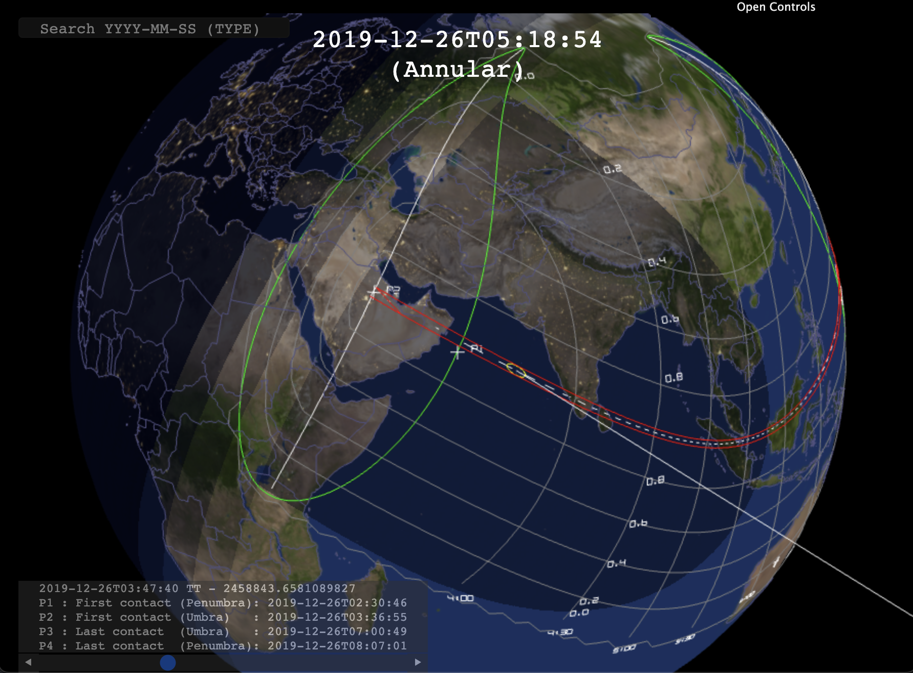

# Bessel3d
Bessel3d implements real-time WebGL visualization of Solar Eclipses. The penumbra is computed each frame in a fragment shader. Contour curves are computed for the umbra, maximum magnitude and the location of point-wise maximum magnitudes at 30-minute intervals.

The computation of the contour curves for the maximum magnitude is a very time-consuming process so an attempt to speed up the process with a dedicated fragment shader has been implemented: The first estimate for the moment of maximum magnitude is computed in a dedicated shader. This significantly reduces the computation time. However, the implementation of this pre-processing currently suffers from issues with Intel GPUs.

The code is still heavily under development and currently visualizes only a single fixed solar eclipse. The ephemeris for the Moon is also somewhat inaccurate, which can introduce about 30 km error.

Large portion of the computation is performed with [orbits.js](https://github.com/vsr83/orbits.js).

Click below to execute the version with GPU-preprocessing.

If the visualization has issues, try the non-optimized version at:
[https://vsr83.github.io/Bessel3d/index_nogpu.html](https://vsr83.github.io/Bessel3d/index_nogpu.html).

## Attributions
1. The JSON Earth map has been generated from [Natural Earth Data](https://www.naturalearthdata.com/) via the website [https://geojson-maps.ash.ms/](https://geojson-maps.ash.ms/).
2. The Earth day and night textures are from the Solar System Scope [website](https://www.solarsystemscope.com/textures/).
