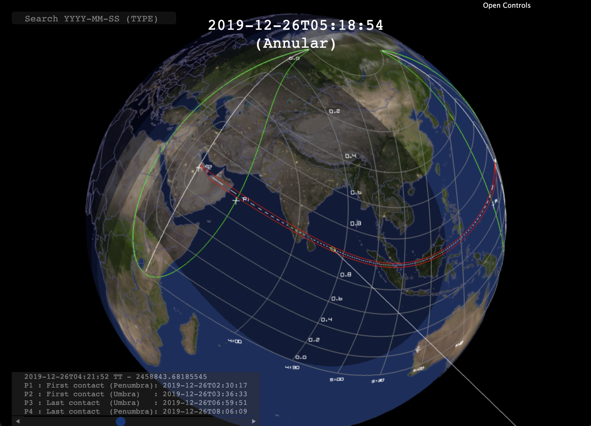

# Bessel3d
Bessel3d implements real-time WebGL visualization of Solar Eclipses. The penumbra is computed each frame in a fragment shader. Contour curves are computed for the umbra, maximum magnitude and the location of point-wise maximum magnitudes at 30-minute intervals.

Since the computation of the contour curves for the maximum magnitude is a very time-consuming process, the computation is performed in the background with a dedicated Worker thread with increasing density of the grid. That is, the contour curves increase in accuracy during the visualization.

By default, Bessel3d computes all Solar Eclipses between 1900 and 2100. The eclipse can be selected using a search bar. The computation is based on a truncated ELP2000-82b series for the Moon and full VSOP87A series for the Earth. The conversions between the TDB time used by ELP2000-82b and VSOP87A and the UT1 time for Earth rotations is computed based on linear interpolation of the Earth Orientation Parameters from [IERS](https://datacenter.iers.org/data/latestVersion/EOP_C01_IAU1980_1900-now.txt). For eclipses after 2022, the last UT1-TAI value is used.

When compared to eclipse computations from other sources, it generally seems that the error in the umbra stays below 10 km. Source for this error is unknown. In addition to this error, the curves associated to sunrise and sunset are computed with the assumption that the Earth is a perfect sphere.

Large portion of the computation is performed with [orbits.js](https://github.com/vsr83/orbits.js).

Click below to execute:

## Attributions
1. The JSON Earth map has been generated from [Natural Earth Data](https://www.naturalearthdata.com/) via the website [https://geojson-maps.ash.ms/](https://geojson-maps.ash.ms/).
2. The Earth day and night textures are from the Solar System Scope [website](https://www.solarsystemscope.com/textures/).
3. The search bar is implemented with [autoComplete.js](https://tarekraafat.github.io/autoComplete.js/#/). See license at [https://github.com/vsr83/Bessel3d/tree/main/imports/LICENSE.autoComplete.txt](imports/LICENSE.autoComplete.txt). The CSS style file has been modified. 
4. The controllers have been implemented with [dat.gui](https://github.com/dataarts/dat.gui). See license at [https://github.com/vsr83/Bessel3d/tree/main/imports/LICENSE.dat.gui.txt](imports/LICENSE.dat.gui.txt).
